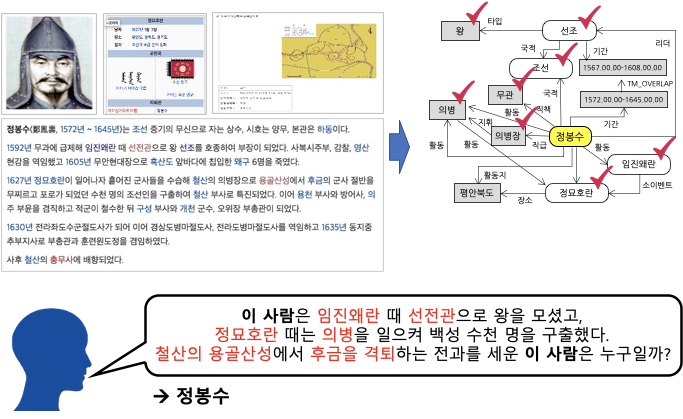

<p align="center">
  <a>
    
  </a>
</p>

<div align="center">
<h1> KLUE Relation Extraction </h1> 


</div>


<!-- END doctoc generated TOC please keep comment here to allow auto update -->

## Introduction

<p align="center">
  
</p>

본 프로젝트의 주제인 관계 추출(Relation Extraction, RE)는 문장 내의 두 개체 사이의 관계를 추출하는 작업입니다. 프로젝트를 수행하기 위해 저희 팀에서는 한국어 자연어 이해 벤치마크 데이터셋인 KLUE(Korean Language Understanding Evaluation)의 RE 데이터셋에 Hugging Face에서 제공하는 사전 학습 모델들을 활용하여 문장 속 단어들의 관계를 30개의 관계 클래스로 분류하는 모델을 만들었습니다. 


## Features

* Typed Entity Marker
* Pretrained Model + Bi-LSTM classifier
* RE-MC (in 'template' branch)
* UniST (in 'template' branch)
* R-BERT (in 'template' branch)
* Lightning + Hydra template (in 'template' branch)
* F-Mask
* streamlit


## How To Use

#### Dependencies

```bash
pandas==1.1.5
scikit-learn~=0.24.1
transformers==4.23.0
matplotlib
streamlit
```

#### Train

```bash
cd code/
python3 train.py
```

#### Inference

```bash
cd code/
python3 interence.py
```

**NOTE:** 'template' 브랜치에서 추가적인 기능을 사용하실 수 있습니다.

## Contributors

<table align='center'>
  <tr>
    <td align="center">
      <br>
      <a href="https://github.com/dustnehowl">
        
      </a>    
    </td>
    <td align="center">
      <br>
      <a href="https://github.com/jingi-data">
        
      </a>    
    </td>
    <td align="center">
      <br>
      <a href="https://github.com/SeokSukyung">
        
      </a>
    </td>
    <td align="center">
      <br>
      <a href="https://github.com/Secludor">
        
      </a>
    </td>
    <td align="center">
      <br>
      <a href="https://github.com/gyunini">
        
      </a>
    </td>
    <td align="center">
      <br>
      <a href="https://github.com/Yeonseolee">
        
      </a> 
    </td>
  </tr>
</table>


## Reference
[1] Zhou, W., & Chen, M. (2021). An improved baseline for sentence-level relation extraction. arXiv preprint arXiv:2102.01373 An Improved Baseline for Sentence-level Relation Extraction - Typed Entity Marker  
[2] Huang, J. Y., Li, B., Xu, J., & Chen, M. (2022). Unified semantic typing with meaningful label inference. arXiv preprint arXiv:2205.01826. Unified Semantic Typing with Meaningful Label Inference - Semantic Typing  
[3] Wu, S., & He, Y. (2019, November). Enriching pre-trained language model with entity information for relation classification. In Proceedings of the 28th ACM international conference on information and knowledge management (pp. 2361-2364). Enriching Pre-trained Language Model with Entity Information for Relation Classification - R-BERT  
[4] https://github.com/monologg/R-BERT Pytorch implementation of R-BERT: "Enriching Pre-trained Language Model with Entity Information for Relation Classification"  